# My 2 way market place template

Link to the deployed app: https://powerful-river-52993.herokuapp.com/
<br/>
Link to github repo: https://github.com/lingyenlee/booksbuzza

## Section 1: Requirement checklist 

Each time you have completed a requirement check it off the list. This way it will be easy for the educators as well as yourselves to track your progress.


- [X] 1. Create your app using Ruby on Rails.
- [X] 2. Use Postgresql database in development and production.
- [X] 3. My app has authentication (eg. Devise).
- [X] 4. My app has authorisation (i.e. users have restrictions on what they can see and edit).
- [X] 5. My app has some type of file (eg. images) uploading capability.
- [X] 6. My app is deployed to Heroku (recommended) or AWS.
- [X] 7. I have identified the problem I am trying to solve by building this particular marketplace app.
- [X] 8. I have explained why is it a problem that needs solving.
- [X] 9. I have provided a link (URL) to my deployed app (i.e. website)
- [X] 10. I have provided a link to my GitHub repository (repo). I have ensured the repo is accessible by my Educators.
- [X] 11. I have a complete description of my marketplace app (website), including:  
        - 11.1 Purpose  
        - 11.2 Functionality / features  
        - 11.3 Sitemap  
        - 11.4 Screenshots  
        - 11.5 Target audience  
        - 11.6 Tech stack (e.g. html, css, deployment platform, etc)  

- [X] 12. I have provided user stories for my app
- [X] 13. I have provided Wire-Frames for my app 
- [X] 14. I have provided an ERD for my app
- [X] 15. I have explained the different high-level components (abstractions) in my app
- [X] 16. I have listed and described any third party services that your app will use
- [X] 17. I have described my projects models in terms of the relationships (active record associations) they have with each other.
- [X] 18. I have discussed the database relations to be implemented in my application
- [X] 19. I have provided my database schema design
- [X] 20. I have described the way tasks are allocated and tracked in my project

NB Slide/Presentation specific requirements

- [X] 21. An outline of the problem I solved by building this particular marketplace app, and why it’s a problem that needs solving.
- [x] 22. A well planned walkthrough of my app
- [X] 23. I have practived my presentation at least once and it is 5-6 minutes long. 


### Rubric Criteria

## Section 2: Documentation 
NB leave the Titles as they are and answer the questions below.

##### 1. Explain the different high-level components (abstractions) in your App.
* Precisely explains and shows understanding of the different high-level components of the app

**Site Map**
<div align="center">
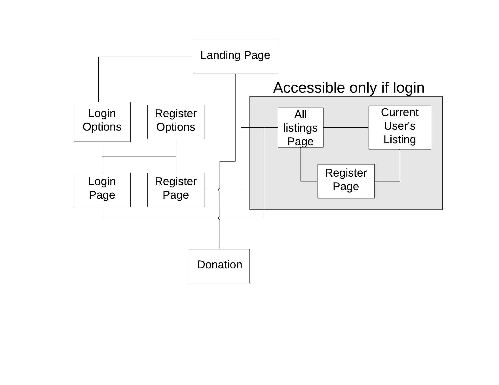
</div>

This app called BooksBuzza is an online marketplace for people to sell and buy old books. It is written in Ruby on Rails (RoR) framework. RoR is based on the Model-View-Controller (MVC) design pattern and breaks the app into three components - Model, View and Controller. This architecture design helps to handle the logic and presentation separately, applies the DRY principles and makes it easier to debug and scale, if neccessary.

There are 4 models in this app - Listing, User, Category and Condition and 2 controllers, listings and users, to handle the logic involving users and listings. On the front, the pages being presented include the landing page, login/logout pages, editing user page, a creating and editing listing page and a page of all listings. 

In order to use the app, a user has to sign up and login either by email or through facebook. Except for the Donation button, all buttons in the landing page will direct the users to either the Register and Login pages. To make a donation, the user need not to be signed in.

Once login, the following happens

- users are welcome by their name and a profile image will appear next to their name, either from facebook or the profile image they upload when signup. If they did not provide a profile image, a default avatar image will appear. 
- users are able to view their listing (this is achieved by creating another route that pass in the user id as a parameter and the controller returning the user's listings). 
- users are able to create a listing as well as and edit his/her profile. If users do not provide an image for the listing, a default image will appear.
- users are able to look at all the listings being posted by other users but will not being able to edit/delete their listings except his/her own listing. If the listing is not theirs, a contact button will appear available (but it is not implemented currently). 

**Features**

1. CRUD functions for listing - users can create a list and saved to the postgresql database. This list can be viewed, edited and updated. The list can also be deleted. The functions are implemented in the listing controller.

2. CRUD functions for users - users can register for an account, edit the profile changing password and cancer account. This is managed by using Devise gem. 

3. Search function - users can search for the type of book categories or the book title. 

4. Facebook login - Being able to login through social media is a popular way to get users to use the app as the signup and login steps are faster.

5. Payment Platform for donation - happy users can donate $10 by clicking on the "Donate $10" button and they will be directed to the Stripe payment platform. After payment, they are redirected back to a page that says "Thank you". 

**Tech stack used**

- Frontend: HTML5, SCSS, Embedded Ruby and Bootstrap

- Backend/Server: Ruby v2.7.1, Ruby on Rails v5.2.4

- Database: Postgresql and D-Beaver

- Cloud Storage: Amazon S3

- Deployment: Heroku

- Version control: Git/Github

- Wireframe: Balsamiq

- Task management: Trello

**Screenshots**

<div align="center">
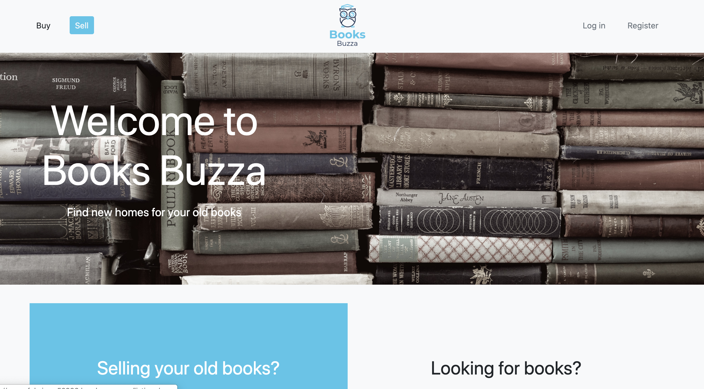
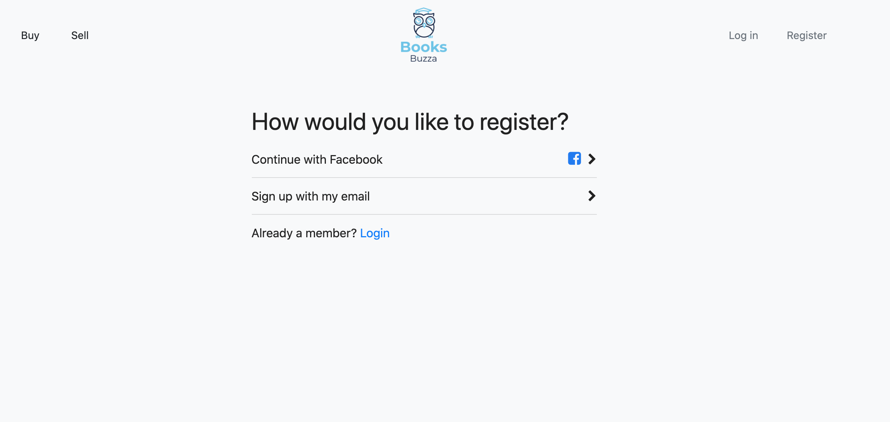
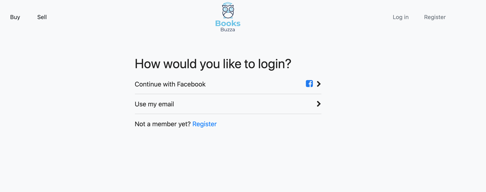
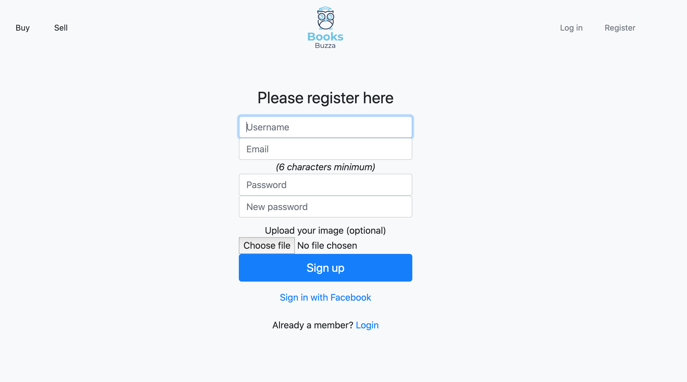
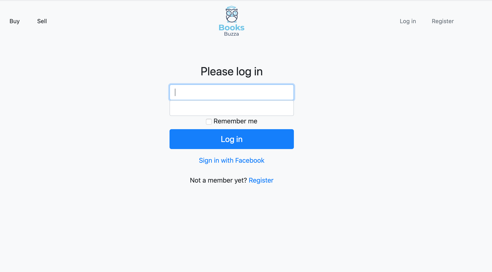
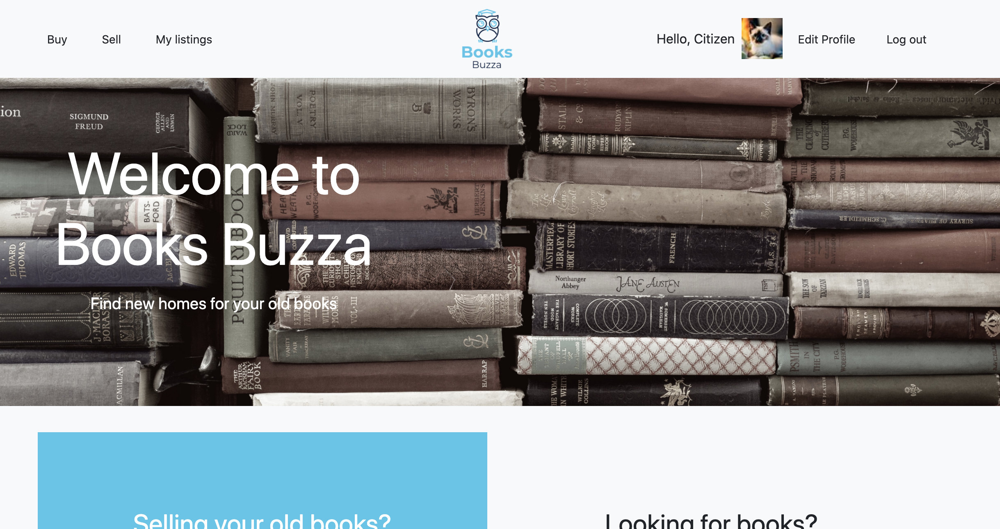
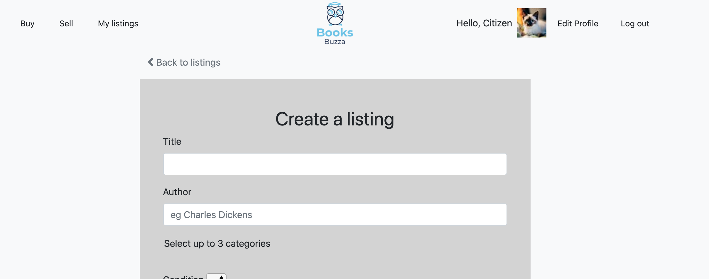
</div>

 
##### 2. List and describe any 3rd party services.
* Includes a complete and detailed description of third party services used in the app


**Devise** The Devise gem is used to facilitate user authentication. It provides a very good out-of-the-box solution to the complications of creating user registration and login authentication functions from the ground. It consists of 10 modules including hashing passwords, storing them in database to match logins, recovering passwords, sending confirmations, etc. Once installed, it creates useful helpers for use in the app. 

The ones used in this app include:
```before_action :authenticate_user!``` - used in controller to restrict authenticated users to access actions (Views)

```user_signed_in?``` - used as a checkpoint to check if user is signed in

```current_user``` - available once user is signed in and can be used to access fields associated with current user such as id.

**Amazon S3** Amazon S3 is a cloud storage provider and is used here to store images uploaded by the user.
When a image is uploaded to S3, it is then available as an url for access. It provides a better solution than storing the images at local storage, as data in the cloud can be retrieved anywhere (as long as there's internet connection).

**Stripe** Stripe is a online payment platform similar to Paypal. It is used in this app to accept donations.

**Omniauth-facebook** The Omniauth-facebook is used in this app and integrated with Devise to implement Facebook (FB) login in this app. To allow FB login, at least additional fields are added to the User table - provider and uid and along with other fields such as name and image, if needed. The provider indicates which OAuth is used (eg facebook, google, twitter) and the uid is a unique ID of the user. The User model is then modified to accept users from FB login. In addition, FB login requires secure web hosting at HTTPS. To achieve this, the SSL key and cert are generated using OpenSSL and installed in the app and the Puma server is modified to serve the app at HTTPS.

**Bootstrap** Bootstrap is used in this app for SCSS styling of the pages.

**Figaro** The Figaro gem is installed in the app which generates a ```config/application.yml``` file which is added to the ```.gitignore``` file. All the sensitive information such as Facebook App ID and Secret Key can be stored in this file and access through the of ```ENV["app_id"]```.


##### 3.1. Identify the problem you’re trying to solve by building this particular marketplace App?
* Demonstrates a full understanding of the problems that exist in a relevant marketplace that needs disrupting
##### 3.2 Why is the problem identified a problem that needs solving?
* Demonstrates a full understanding of the problems that exist in a relevant marketplace that needs disrupting

Currently there are many online bookstores that sell new books but not many that focuses on selling old books. A book lover usually don't like to throw books away and preferred to pass them on to someone who can read them. Others at the same time don't want to spend too much to buy new books. This marketplace allows sellers to get rid of their old books and make some cash. 

##### 4. Describe your project’s models in terms of the relationships (active record associations) they have with each other.
* Complete discussion of the project’s models with an understanding of how its active record associations function

The app has 5 tables - Users, Listings, Categories, Conditions and a join table between listings and categories. Active storage is also set up to store pictures in each tables.

The relationships between the tables are as follows:

1. A user can create many listings (```has_many```) and a listing is created by a user (```belongs_to```). When a user is deleted, all the associ.ted listings are also deleted (```dependent: :destroy```), 
2. A listing has one condition (```belongs_to```) and many conditions are available in each listing (```has_many```) where is it also has a dependent association to a listing when it is deleted (```dependent: :destroy```).
3. The listing and category tables are connected to each other using a join table (```has_and_belongs_to_many)``` which creates a direct many-to-many relationship to form a listings_categories table. A listing has many categories and many categories are found in a listing.
4. The listing and the user are associated with the active storage with ```has_one_attached :picture```.

There are 4 models as the join table is not a model. The associations of each model are shown below

**User model**
	
	class User < ApplicationRecord
		has_many :listings, dependent: :destroy
		has_one_attached :picture
	end

**Listing model**

	class Listing < ApplicationRecord
		belongs_to :user
		belongs_to :condition
		has_and_belongs_to_many :categories
		has_one_attached :picture
	end
	
**Condition model**

	class Condition < ApplicationRecord
		has_many :listings, dependent: :destroy
	end

**Category model**

	class Category < ApplicationRecord
		has_and_belongs_to_many :listings
	end


##### 5. Discuss the database relations to be implemented.
* Provides coherent discussion of the database relations, with reference to the ERD


<div align="center">
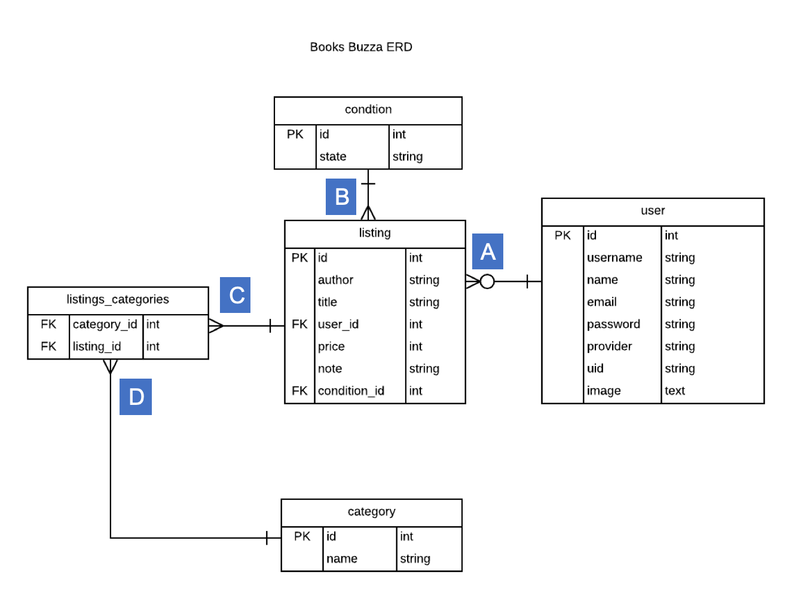
<p><strong>Figure 1: ERD of Books Buzza App</strong> 
</div>


A table consists of columns of fields and rows of records. Each row has a unique identifier known as **Primary Key (PK)** which is usually denoted by ID and generated automatically by integer increment when a record is created. Two tables are associated with each other either through ```has_many```, ```belongs_to``` or ```has_and_belongs_to_many``` relationships through the use of **Foreign Key (FK)**. A table can have more than one FK. Tables without FK(s) are generally created first as they don't have the dependency on other tables. In this app, the order of tables created are: user, condition, category, listing and lastly the join tables between listing and category.


In the **User** table, the basic fields are username, password with other fields added when implementing Facebook authentication and these include provider, uid, name and image. 

The **Condition** table has only 1 field: state.

The **Category** table has only 1 field: name.

The user table has a **one-to-many** association relationship ***(A in Figure 1)*** to the **Listing** table and this is achieved with the use of User ID (PK) as the FK in the listing table. Similarly, the condition table is a 
**one-to-many** association relationship to the listing table ***(B in Figure 1)*** through the use of condition_id as FK in the listing table. The fields in the listing table are author, title, price, condition_id, user_id and note.

The last table to be created is the listings and categories join table. It is join through by the use of PKs from listing and category table with **many-to-many relationships** ***(C and D in Figure 1)*** It doesn't have a primary key. The 2 fields in the **listings_categories** table are listing_id and category_id.


##### 6. Provide your database schema design.
* Flawless, complex, complete, and well thought through ERDs provided

The datebase schema design for the app is shown below. Tables are created or modified by generating migration files. In addition to the fields described in Question 5, a timestamp field is also created when tables are generated. It consists of 2 variables ```created_at``` and ```updated_at``` which can be extracted for use.

Also, in addition to the 5 tables described in Question 5. Rails also provide the facilities to upload files to cloud storage services (eg Amazon S3) with its Active Storage Model. This is setup by running the following commands:

	rails active_storage:install
	rails db:migrate 
	
This creates 2 other tables: ```active_storage_blobs``` and ```active_storage_attachments```. 
In addition, a sessions table is created when implementing Facebook Authentication.


	ActiveRecord::Schema.define(version: 2020_05_19_044548) do

**"users" table**

		create_table "users", force: :cascade do |t|
			t.string "email", default: "", null: false
			t.string "encrypted_password", default: "", null: false
			t.string "reset_password_token"
			t.datetime "reset_password_sent_at"
			t.datetime "remember_created_at"
			t.datetime "created_at", null: false
			t.datetime "updated_at", null: false
			t.string "username"
			t.string "provider"
			t.string "uid"
			t.string "name"
			t.text "image"
			t.index ["email"], name: "index_users_on_email", unique: true
			t.index ["reset_password_token"], name: "index_users_on_reset_password_token", unique: true
		end

**"categories" table**
		
		  create_table "categories", force: :cascade do |t|
		    t.string "name"
		    t.datetime "created_at", null: false
		    t.datetime "updated_at", null: false
		  end
	  
**"conditions" table**

		create_table "conditions", force: :cascade do |t|
		    t.string "state"
		    t.datetime "created_at", null: false
		    t.datetime "updated_at", null: false
		 end
		 

**"Categories_listings" table"**

		  create_table "categories_listings", id: false, force: :cascade do |t|
		    t.bigint "listing_id", null: false
		    t.bigint "category_id", null: false
		  end

**"Sessions" table**
		  
		  create_table "sessions", force: :cascade do |t|
		    t.string "session_id", null: false
		    t.text "data"
		    t.datetime "created_at", null: false
		    t.datetime "updated_at", null: false
		    t.index ["session_id"], name: "index_sessions_on_session_id", unique: true
		    t.index ["updated_at"], name: "index_sessions_on_updated_at"
		  end
	
**"active_storage_attachments" table**
	
		  create_table "active_storage_attachments", force: :cascade do |t|
		    t.string "name", null: false
		    t.string "record_type", null: false
		    t.bigint "record_id", null: false
		    t.bigint "blob_id", null: false
		    t.datetime "created_at", null: false
		    t.index ["blob_id"], name: "index_active_storage_attachments_on_blob_id"
		    t.index ["record_type", "record_id", "name", "blob_id"], name: 			"index_active_storage_attachments_uniqueness", unique: true
		  end

**"active_storage_blobs" table**

		  create_table "active_storage_blobs", force: :cascade do |t|
		    t.string "key", null: false
		    t.string "filename", null: false
		    t.string "content_type"
		    t.text "metadata"
		    t.bigint "byte_size", null: false
		    t.string "checksum", null: false
		    t.datetime "created_at", null: false
		    t.index ["key"], name: "index_active_storage_blobs_on_key", unique: true
		  end
		

		  add_foreign_key "active_storage_attachments", "active_storage_blobs", column: "blob_id"
		  add_foreign_key "listings", "conditions"
		  add_foreign_key "listings", "users"
	end
	


##### 7. Provide User stories for your App.
* You also just use normal markdown to describe them
* User stories are well thought out, relevant, and comprehensively cover the needs of the app

As a user, I am able to login and logout.
As a user, I am able to change my login username and password.
As a seller, I am able to create a book listing.
As a seller, I am able to edit my book listing.
As a seller, I am able to delete my book listing.
As a buyer, I am able to search the listing based on categories of book.
As a buyer, I am able to search the listing based on authors.


##### 8. Provide Wireframes for your App.

<div align="center">
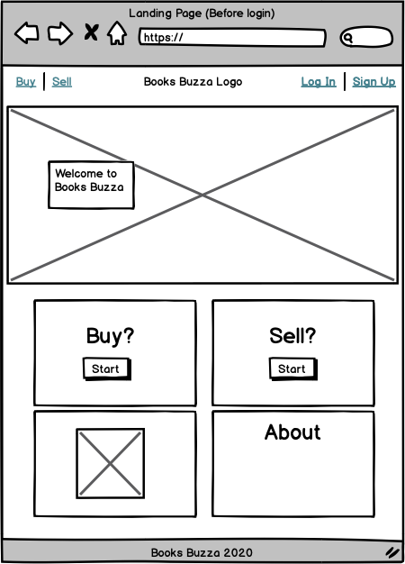
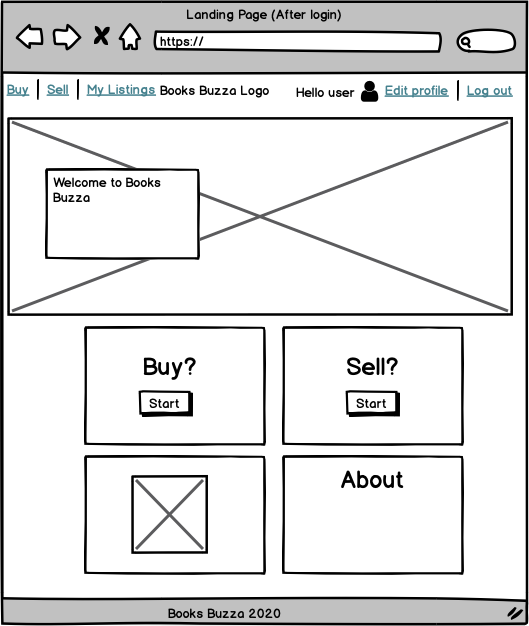
</div>
<div align="center">
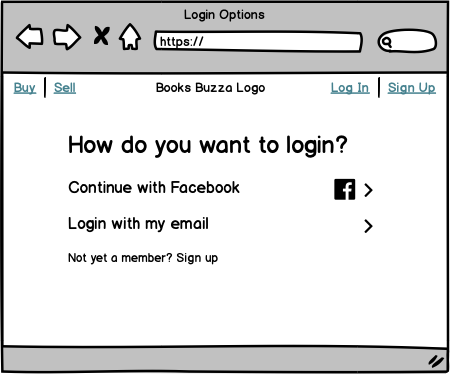
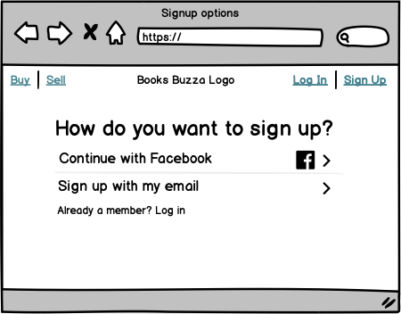
</div>
<div align="center">
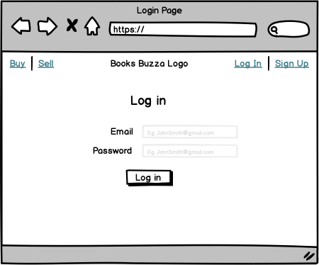
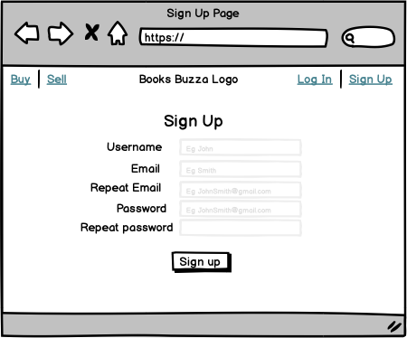
</div>
<div align="center">
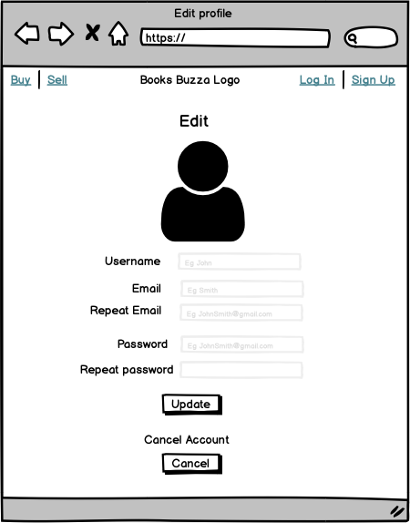
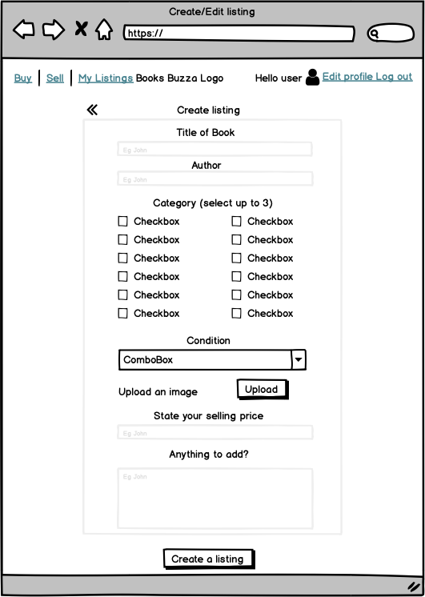
</div>
<div align="center">
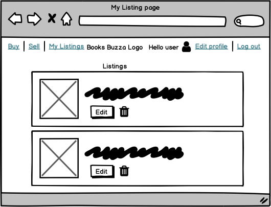

</div>

* More than five detailed and well designed wireframes provided, for several different screen sizes (as required for the app)

##### 9. Describe the way tasks are planned and tracked in your project.

* Shows significant planning for how tasks are planned and tracked, including a full description of the process and of the tools used


Trello is being used for planning and tracking progress. 
The workplan is divided into 7 epics:
Epic 1-Setup authenticating functions including facebook
Epic 2-Setup Models and seeding
Epic 3-Make CRUD functions for listing
Epic 4-Setup AWS and active storage
Epic 5-Setup search functions
Epic 6-Setup stripe payment functions

A screenshot is shown below:


<div align="center">
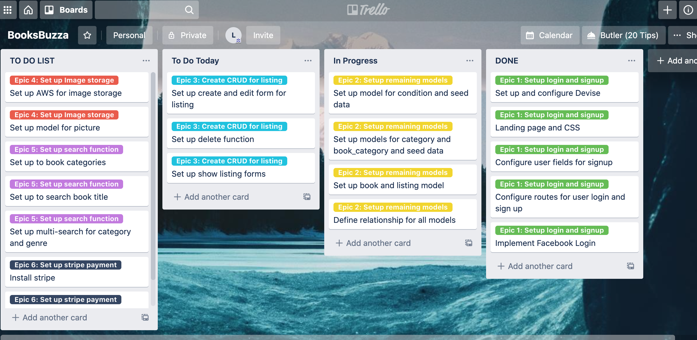
</div>

##### 10. ERD provided represents a normalised database model.
* Meets D with no duplication and ideal definition of entities.

div align="center">

<p><strong>Figure 1: ERD of Books Buzza App</strong> 
</div>

As each listing can have many categories, the data is normalised with the use of a join table between listing and category tables. This join table shows records of each listing with a category, represented by the listing_id and category_id respectively.


